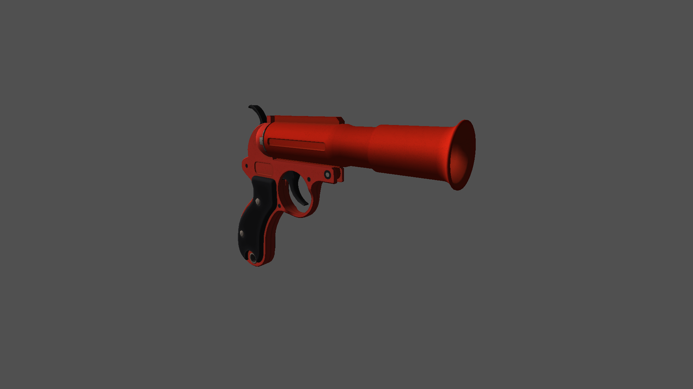

# Software Renderer
Short CPU software renderer written in C++.

Features:
  * OBJ Loading
  * Triangle Rasterization
  * Image loading and storing
  * Texturing
  * GLSL-like shader support for custom lighting

Sample Render:

